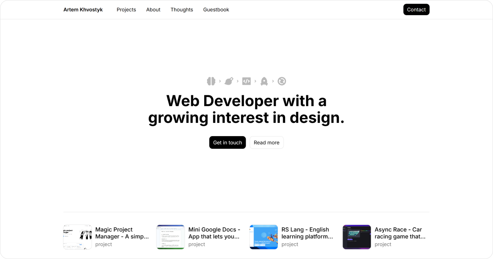

# My Personal Website



This is the repository for my personal website, a space where I showcase my projects and let people leave their mark (literally, there’s a guestbook for your drawings).

If you like what you see, feel free to leave a star ⭐️ - it's a virtual high-five.

## Tech Stack

- **Framework:** Next.js.

- **Styling:** CSS/SCSS Modules - yes, I’m a Tailwind hater.

- **Database:** Supabase - used for authentication and drawings.

- **CMS:** Sanity - to manage projects and content.

## Project Structure

Here’s how the project is organized:

- `src/app`: Classic Next.js app directory for routing.

- `src/components` Reusable components.
  
  - `/auth`: Components, related to auth.

  - `/common`: Shared components.

  - `/core`: Foundational components like buttons, forms, alerts.

  - `/dialogs`: Manages dialog components.

  - `/providers`: All providers live here.

- `src/constants`: Global constants.

- `src/hooks`: Reusable hooks.

- `src/services`: Services for working with Supabase and Sanity.

- `src/styles`: Global styles, mixins, and CSS reset.

- `src/types`: Global reusable types.

- `src/utils`: Utility functions for authentication, pagination, and more.

## Getting Started

Clone the repository, install dependencies with

```bash
pnpm i
```

Copy `.env.example` to `.env` and fill in the required values.

### Run the development server

```bash
pnpm dev
```

## Credits

- Website Inspiration: [Significa](https://significa.co/) 🥰.

- Demo Recording Software: [Cursorful](https://cursorful.com/).

- 3D video: [Roman Klčo](https://romanklco.com/).

## License

This project is available under the GPL3 license, so feel free to explore, learn, and adapt it for your use. See the [LICENSE](./LICENSE) file for more info.
